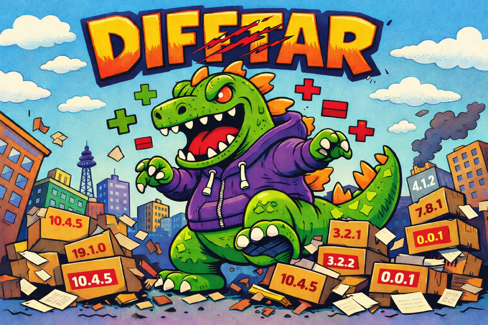

<p align="center">
  
</p>

<h1 align="center">difftar</h1>

<p align="center">
  <strong>RAWR! I'm Difftar! The giant green tarball-diffing monster!</strong><br>
  Compute unified diffs between npm package tarballs, anywhere.
</p>

<p align="center">
  <a href="https://www.npmjs.com/package/difftar"></a>
  <a href="https://github.com/indexzero/difftar/blob/main/LICENSE"></a>
  
</p>

---

## Why Difftar?

You know `npm diff`? It's great for comparing package versions locally. But what if you need to:

- **Run diffs on the edge** - in a Cloudflare Worker, Deno Deploy, or serverless function?
- **Compare tarballs from different sources** - S3, R2, private registries, or inline data?
- **Integrate diff into your API** - without shelling out to the npm CLI?

Difftar brings the power of `npm diff` to any JavaScript runtime. Same output format, zero native dependencies, runs anywhere.

---

## Quick Start

### Install

```bash
npm install difftar
```

<details>
<summary>Other package managers</summary>

```bash
pnpm add difftar
yarn add difftar
bun add difftar
```
</details>

### Your First Diff

```javascript
import { diff } from 'difftar';

const patch = await diff(
  { transport: 'url', source: 'https://registry.npmjs.org/is-number/-/is-number-7.0.0.tgz' },
  { transport: 'url', source: 'https://registry.npmjs.org/is-odd/-/is-odd-3.0.1.tgz' }
);

console.log(patch);
```

### Or Use the CLI

```bash
# Using package specs (like npm diff)
npx difftar --diff is-number@7.0.0 --diff is-odd@3.0.1

# Using URLs directly
npx difftar https://registry.npmjs.org/lodash/-/lodash-4.17.20.tgz \
            https://registry.npmjs.org/lodash/-/lodash-4.17.21.tgz
```

---

## CLI Usage

```
difftar <left-url> <right-url> [options]
difftar --diff <spec> --diff <spec> [options]
```

### Common Examples

```bash
# Compare two versions of a package
difftar --diff express@4.18.0 --diff express@4.19.0

# Show only changed file names
difftar --diff lodash@4.17.20 --diff lodash@4.17.21 --diff-name-only

# Ignore whitespace changes
difftar --diff pkg@1.0.0 --diff pkg@2.0.0 --diff-ignore-all-space

# Private registry with authentication
difftar --diff @myorg/pkg@1.0.0 --diff @myorg/pkg@2.0.0 \
        --auth=bearer --token=npm_xxxxx
```

### CLI Options

| Option | Description |
|--------|-------------|
| `--diff <spec>` | Package spec (e.g., `lodash@4.17.21`) or tarball URL. Use twice. |
| `--diff-name-only` | Only show changed file names |
| `--diff-unified=N` | Number of context lines (default: 3) |
| `--diff-ignore-all-space` | Ignore all whitespace changes |
| `--diff-ignore-space-change` | Ignore changes in whitespace amount |
| `--diff-no-prefix` | Remove `a/` `b/` prefixes from paths |
| `--diff-src-prefix=X` | Source prefix (default: `a/`) |
| `--diff-dst-prefix=X` | Destination prefix (default: `b/`) |
| `--diff-text` | Treat all files as text (including binary) |
| `--auth=bearer\|basic` | Authentication type |
| `--token=TOKEN` | Auth token or base64 credentials |

---

## API

### `diff(left, right, options?)`

Compare two tarballs and return a unified diff string.

```javascript
import { diff } from 'difftar';

const patch = await diff(
  { transport: 'url', source: 'https://registry.npmjs.org/lodash/-/lodash-4.17.20.tgz' },
  { transport: 'url', source: 'https://registry.npmjs.org/lodash/-/lodash-4.17.21.tgz' },
  { context: 5 }
);
```

### Source Configuration

Each source (left/right) is configured with a `SourceConfig` object:

```typescript
type SourceConfig = {
  transport: 'url' | 's3' | 'inline' | 'file';
  source?: string;              // URL, S3 URI, or file path
  auth?: 'none' | 'basic' | 'bearer';
  credential?: string;          // Token or base64(user:pass)
  s3?: S3Config;                // For S3 transport
  data?: Uint8Array | string;   // For inline transport
};
```

#### Transport Examples

**URL (public registry)**
```javascript
{ transport: 'url', source: 'https://registry.npmjs.org/lodash/-/lodash-4.17.21.tgz' }
```

**URL (private registry with bearer token)**
```javascript
{
  transport: 'url',
  source: 'https://npm.pkg.github.com/@org/pkg/-/pkg-1.0.0.tgz',
  auth: 'bearer',
  credential: process.env.GITHUB_TOKEN
}
```

**URL (basic auth)**
```javascript
{
  transport: 'url',
  source: 'https://registry.example.com/pkg/-/pkg-1.0.0.tgz',
  auth: 'basic',
  credential: btoa('username:password')
}
```

**S3 (AWS)**
```javascript
{
  transport: 's3',
  source: 's3://my-bucket/packages/pkg-1.0.0.tgz',
  s3: {
    accessKeyId: process.env.AWS_ACCESS_KEY_ID,
    secretAccessKey: process.env.AWS_SECRET_ACCESS_KEY,
    region: 'us-east-1'
  }
}
```

**S3 (Cloudflare R2)**
```javascript
{
  transport: 's3',
  source: 's3://my-bucket/pkg.tgz',
  s3: {
    accessKeyId: process.env.R2_ACCESS_KEY_ID,
    secretAccessKey: process.env.R2_SECRET_ACCESS_KEY,
    region: 'auto',
    endpoint: 'https://account-id.r2.cloudflarestorage.com'
  }
}
```

**Inline (Uint8Array or base64)**
```javascript
// For npm publish _attachments or testing
{ transport: 'inline', data: tarballUint8Array }
{ transport: 'inline', data: base64EncodedString }
```

**File (Node.js/Bun/Deno only)**
```javascript
{ transport: 'file', source: '/path/to/package.tgz' }
```

### Diff Options

```typescript
type DiffOptions = {
  nameOnly?: boolean;           // Only output file names
  ignoreAllSpace?: boolean;     // Ignore all whitespace
  ignoreSpaceChange?: boolean;  // Ignore whitespace amount changes
  context?: number;             // Context lines (default: 3)
  noPrefix?: boolean;           // Remove a/ b/ prefixes
  srcPrefix?: string;           // Source prefix (default: 'a/')
  dstPrefix?: string;           // Destination prefix (default: 'b/')
  text?: boolean;               // Treat binary files as text
};
```

### `diffWithStats(left, right, options?)`

Like `diff()`, but returns metadata about the changes:

```javascript
import { diffWithStats } from 'difftar';

const result = await diffWithStats(left, right);

console.log(`${result.filesChanged} files changed`);
console.log(`${result.filesAdded} files added`);
console.log(`${result.filesDeleted} files deleted`);
console.log(result.output); // The diff string
```

### `extractPackage(config)`

Extract a tarball without computing a diff. Useful for inspection:

```javascript
import { extractPackage } from 'difftar';

const files = await extractPackage({
  transport: 'url',
  source: 'https://registry.npmjs.org/lodash/-/lodash-4.17.21.tgz'
});

for (const [path, content] of files) {
  console.log(`${path}: ${content.length} bytes`);
}
```

### Error Handling

Difftar uses typed errors with phases for proper HTTP status mapping:

```javascript
import { diff, DiffError, isDiffError } from 'difftar';

try {
  await diff(left, right);
} catch (error) {
  if (isDiffError(error)) {
    console.log(`Phase: ${error.phase}`);    // 'FETCH' | 'DECOMPRESS' | 'TAR' | 'DIFF' | 'AUTH' | 'SIZE'
    console.log(`Status: ${error.status}`);  // HTTP status code
    console.log(`Message: ${error.message}`);

    // For API responses:
    return error.toResponse(); // Returns a Response object
  }
}
```

| Phase | HTTP Status | When |
|-------|-------------|------|
| `AUTH` | 401 | Invalid or expired credentials |
| `SIZE` | 413 | Package exceeds 20MB limit |
| `FETCH` | 502 | Network failure |
| `DECOMPRESS` | 422 | Invalid gzip data |
| `TAR` | 422 | Invalid tar structure |
| `DIFF` | 500 | Internal error |

---

## Edge Deployment

Difftar is designed for edge runtimes. Here's a Cloudflare Worker example:

```javascript
import { diff, DiffError } from 'difftar';

export default {
  async fetch(request) {
    const { left, right, options } = await request.json();

    try {
      const patch = await diff(left, right, options);
      return new Response(patch, {
        headers: { 'Content-Type': 'text/plain; charset=utf-8' }
      });
    } catch (error) {
      if (error instanceof DiffError) {
        return error.toResponse();
      }
      return new Response('Internal error', { status: 500 });
    }
  }
};
```

---

## Platform Compatibility

Difftar runs on WinterTC-compatible JavaScript runtimes:

| Platform | Supported | Memory | CPU Time | Wall Time | Notes |
|----------|-----------|--------|----------|-----------|-------|
| Node.js 18+ | Yes | ~4GB | None | None | Full features |
| Bun | Yes | ~4GB | None | None | Full features |
| Deno | Yes | 512MB | 50s | 50s | Full features |
| Google Cloud Run | Yes | Configurable | Configurable | 60m | Full features |
| Cloudflare Workers | Yes | 128MB | 30s | 30s | No filesystem |
| Fastly Compute | Yes | 128MB | 50ms+ | 120s | No filesystem |

### Transport Compatibility

| Transport | Node.js | Bun | Deno | Cloud Run | CF Workers | Fastly Compute |
|-----------|---------|-----|------|-----------|------------|----------------|
| `url` | Yes | Yes | Yes | Yes | Yes | Yes |
| `s3` | Yes | Yes | Yes | Yes | Yes | Yes |
| `inline` | Yes | Yes | Yes | Yes | Yes | Yes |
| `file` | Yes | Yes | Yes | Yes | No | No |

---

## Architecture

Difftar processes tarballs through a monster-themed pipeline:

```
CHOMP      CRUNCH        TEAR        STOMP       ROAR
(Fetch) -> (Decompress) -> (Untar) -> (Diff) -> (Format)
```

| Phase | What it does |
|-------|-------------|
| **CHOMP** | Fetches tarball bytes from URL, S3, file, or inline data |
| **CRUNCH** | Decompresses gzip using native `DecompressionStream` |
| **TEAR** | Extracts tar entries to in-memory file map |
| **STOMP** | Computes Myers diff between file trees |
| **ROAR** | Formats output as unified diff (same as `npm diff`) |

---

## Limitations

### Size Limit: 20MB per tarball

Difftar enforces a 20MB limit per tarball. This covers approximately 98% of packages on npm (based on [npm-high-impact](https://github.com/wooorm/npm-high-impact) analysis).

Why? Edge platforms have memory constraints (128MB on Cloudflare Workers). Two 25MB compressed tarballs could expand to 200MB+ uncompressed, causing OOM errors.

If you need to diff larger packages, run Difftar on Node.js, Bun, or a container-based platform like Google Cloud Run.

### File Transport

The `file` transport requires filesystem access and won't work on Cloudflare Workers or other sandboxed edge runtimes. Use `url`, `s3`, or `inline` transports on those platforms.

---

## License

MIT
